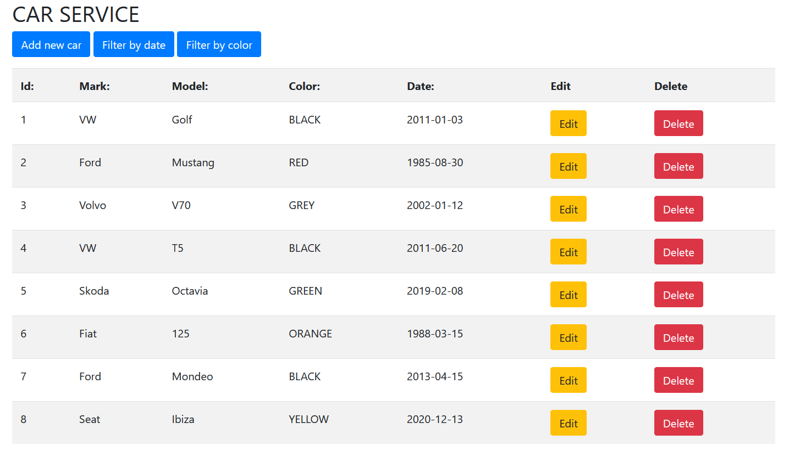
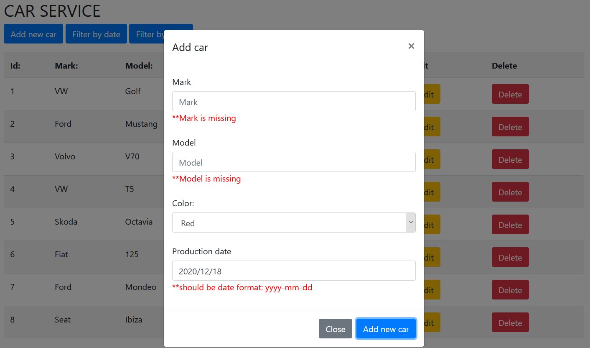
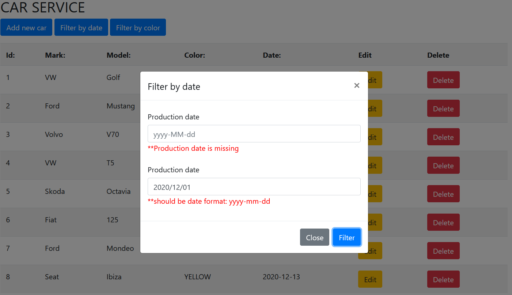
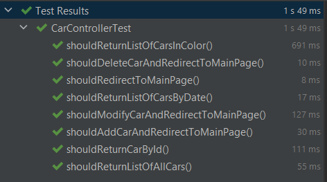

# Car API
[*Spring boot 2 academy*](https://www.akademiaspring.pl/)

## General
API with UI in Thymeleaf. Car as a model of application. The MVC tests performed using Mockito and JUnit5.

Features:
* CRUD
* Filter by color
* Filter from/to date

## Configuration 

application.properties file:

    spring.datasource.url=
    spring.datasource.username=
    spring.datasource.password=
    spring.datasource.driver-class-name=
    spring.datasource.initialization-mode=always
    spring.datasource.data= classpath:/data.sql
    spring.jpa.show-sql=true

## Technologies
- Java 11
- Maven
- Spring Boot 2.4.0
- Swagger
- Thymeleaf
- Bootstrap(CSS)
- JQuery/JavaScript
- MySQL (remotesql.com)
- Mockito
- Junit5

**Design patterns**
- Model-view-controller (MVC) 
- Data Access Object (DAO)

## Screenshots

