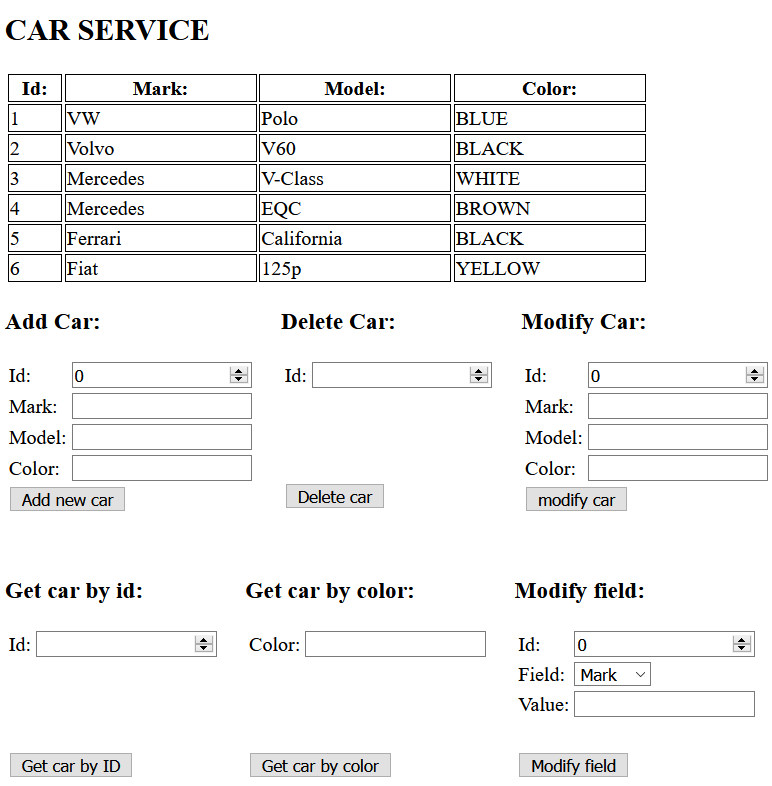

# Car API
[*Spring boot 2 academy*](https://www.akademiaspring.pl/)

## General
REST API with car service as an example.

## Technologies

- Java 11
- Maven
- Spring Boot 2.4.0
- Thymeleaf - UI
- Swagger UI
- Hateoas

## Screenshots

