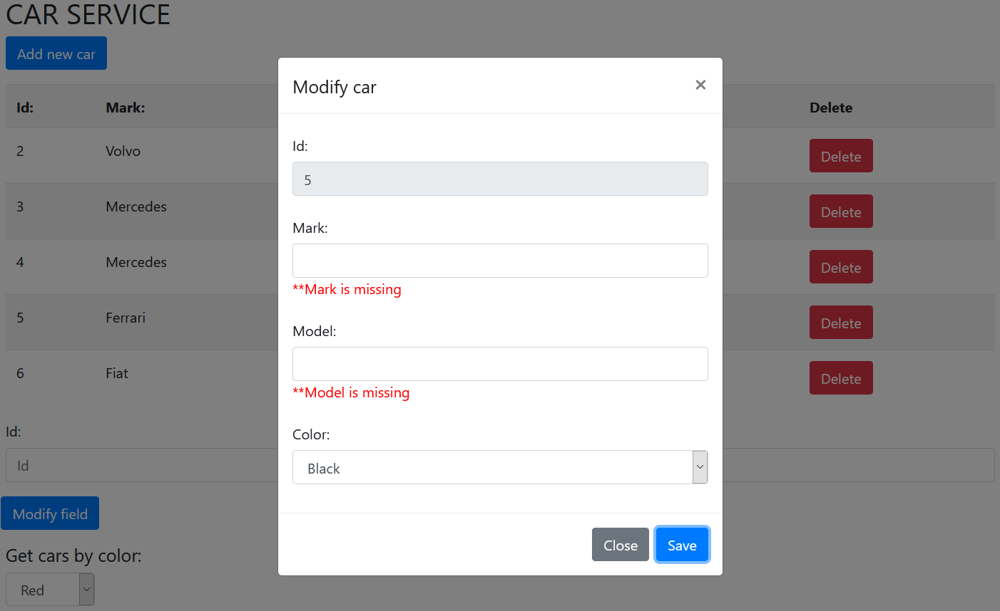

# Car API
[*Spring boot 2 academy*](https://www.akademiaspring.pl/)

## General
API with UI in Thymeleaf. Car as a model of application.

## Technologies
- Java 11
- Maven
- Spring Boot 2.4.0
- Swagger
- Thymeleaf
- Bootstrap(CSS)
- JQuery/JavaScript
- MVC
- DAO
- MySQL (remotesql.com)

## Screenshots

